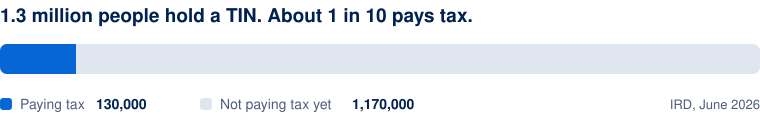
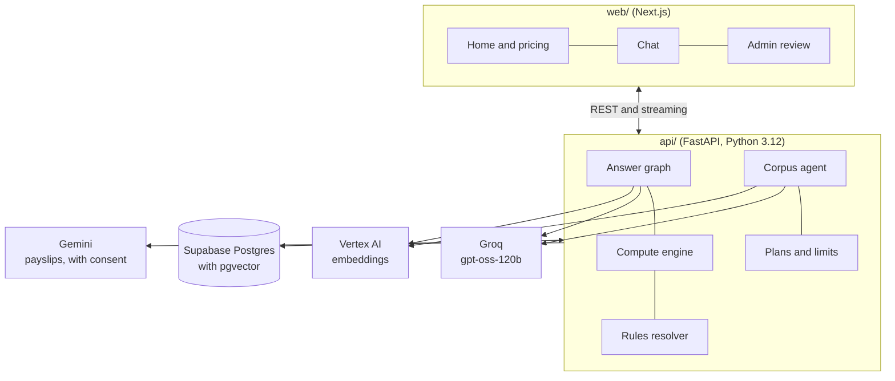
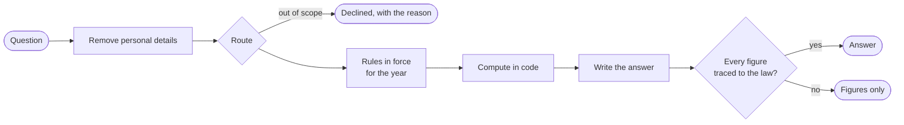
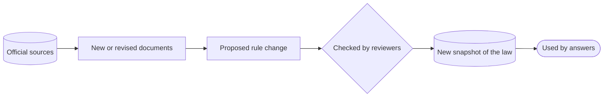

<div align="center">

<picture>
  <source media="(prefers-color-scheme: dark)" srcset="web/public/brand/logo-lockup-dark.png">
  
</picture>

### Sri Lankan income tax, answered with the law behind every figure.

The trusted tax answer for the more than one million Sri Lankans who now hold a TIN and do not pay tax yet.

</div>

---

## Why now

Sri Lanka's income tax base is widening fast, and the people joining it have nowhere reliable to turn.

- **1.2 million** individual income tax files have been opened, according to the IRD's Commissioner of Tax Policy and Law in August 2026.<sup>[1]</sup>
- **1.3 million** people hold a Taxpayer Identification Number, but only about **130,000** pay any tax yet.<sup>[2]</sup> Most of the rest are new to the system, and many of them will become filers.

<picture>
  <source media="(prefers-color-scheme: dark)" srcset="docs/media/tin-dark.svg">
  
</picture>

At the same time, the law keeps moving:

- **The Inland Revenue (Amendment) Act No. 2 of 2025** reset the rates and raised the personal relief to LKR 1,800,000 from 1 April 2025.
- **Act No. 11 of 2026**, certified on 3 June 2026, changed who must file and how instalments work, backdated to 1 April 2025.

A salaried worker, a freelancer paid in dollars or a doctor with channelling fees needs to know what they owe and whether they must file, under this year's law, not last year's.

## The problem with today's answers

| Where people go | What goes wrong |
|---|---|
| **Tax consultants** | Accurate, but costly for a simple question, and booked out near the 30 November deadline. |
| **Forums and social media** | Free, but rarely sourced and often out of date after an amendment. |
| **General AI chatbots** | Fluent, but they cannot say which law they used, mix up years, and can invent a figure. |

Nobody offers a fast, affordable answer that a person can trust and check.

## The product

Ask a tax question in plain words. Citetax works out what you owe, says whether you need to file, and gives the dates, with the section of the Act beside every figure.

- **Trustworthy by design.** Figures follow the law in force for your year of assessment. If something cannot be backed by the law, Citetax says so instead of guessing.
- **Always current.** Citetax follows new circulars and amendments as they are published, and checks them before they reach anyone's answer.
- **Private.** Personal details such as names and NIC numbers are never shared with outside AI services.
- **Local.** Built around Sri Lankan law and how Sri Lankans earn: APIT on a salary, freelance and professional fees, and services paid in foreign currency.

It covers the years of assessment **2025/2026** and **2026/2027** today.

## Who it is for

| | |
|---|---|
| **Salaried employees** | Is the APIT on my payslip all I owe? Do I need to file at all? |
| **Freelancers and IT exporters** | How is income from clients abroad taxed, and what do I set aside? |
| **Professionals with side income** | Doctors, lecturers and consultants with a salary plus fees. |
| **Practices and finance teams** | Accountants and HR teams answering the same questions for many people. |

## Our edge

A general chatbot can sound right. Citetax is built to be right, and to show it.

- **Answers people can check.** Every figure comes with its legal basis, so a user or their accountant can verify it rather than take it on trust.
- **Kept current, with care.** The law changes often. Citetax follows it closely, and nothing new reaches an answer until it has been checked by people.
- **Built for Sri Lanka.** Designed around Sri Lankan law and the way Sri Lankans earn, not adapted from a foreign product.
- **It compounds.** Every amendment, circular and answered question deepens the coverage, and that is hard for a newcomer to catch up with.

## Business model

| | Free | Individual | Team |
|---|---|---|---|
| **Price** | LKR 0 | LKR 1,500 per year of assessment | LKR 5,000 per seat per month |
| **For** | Trying Citetax | Your own return, all season | Practices and finance teams |
| **Questions** | 20 a month, or 5 a day without an account | 300 a month | 1,000 a person a month |
| **Payslip reading** | | Included | Included |

**Unit economics.** An answer costs about LKR 0.65 in AI model time, measured across real usage at October 2026 prices. Running costs are about LKR 20,000 a month, mainly the database and hosting. Citetax breaks even at about 14 Individual plans or 4 Team seats a month, and each Individual plan costs under LKR 400 a year to serve even for a heavy user.

## Going to market

- **The filing season.** Demand peaks before the return deadline of 30 November each year, when people look for answers and consultants are busiest.
- **Communities first.** Freelancer and IT export communities, where the foreign-currency rules are a common source of confusion.
- **Practices and employers.** The Team plan, for accountants and HR teams who answer the same tax questions for many people.
- **Free to start.** The Free plan answers real questions, so people can see that Citetax is right before they pay.

## Roadmap

- **Payments in rupees** through a local payment gateway. Plans are activated by hand today.
- **Team workspace:** shared clients and an exportable record of every answer.
- **More of the law:** rent relief, terminal benefits and final withholding tax.
- **Sinhala and Tamil.**

## Where we are

- **Built and running** for the years of assessment 2025/2026 and 2026/2027: tax computations, filing checks, deadlines and year-on-year changes.
- **Plans in place.** Free, Individual and Team, with usage limits enforced and upgrades granted by hand until payments go live.
- **Keeping up with the law works.** The 2025 and 2026 amendments are already reflected in answers.
- **Next:** payments, the Team workspace, and the first users in the run-up to the 30 November filing deadline.

Citetax began as a project for SLIIT IT3041, Information Retrieval and Web Analytics.

---

## For developers

Citetax is a Next.js web app and a FastAPI service on Postgres, with Groq and Google Vertex AI for language and search.
### Architecture



### How an answer is made

The model reads the question and picks a plan; plain code does everything that produces a number, and every figure in the written answer is checked against the law before it is shown.



### How the law stays current



### Run it

```powershell
cd api
.venv\Scripts\python.exe migrate.py
.venv\Scripts\python.exe -m uvicorn app.main:app --reload

cd web
npm run dev
```

Then open http://localhost:3000.

---

### Sources

1. Ada Derana, 17 August 2026, quoting Nandana Kumar, Commissioner of Tax Policy and Law, Inland Revenue Department: [adaderana.lk](https://www.adaderana.lk/news/cmsww326c0009356qfyt5gtcg)
2. Hiru News, 23 June 2026, IRD media briefing: [hirunews.lk](https://hirunews.lk/english/business/473642/tin-registrations-reach-1-3-million-only-130000-currently-pay-taxes)
3. Inland Revenue (Amendment) Act No. 11 of 2026, certified 3 June 2026: [taxadvisor.lk](https://www.taxadvisor.lk/data/uploads/inland_revenue_amendment_act_no_11_of_2026_.pdf)

*Citetax states what the law provides and what the computation shows. It is not tax advice.*
