<div align="center">

# Citetax

**Sri Lankan personal income tax, worked out line by line. Every number, cited.**

SLIIT IT3041, Information Retrieval and Web Analytics


</div>

Ask a tax question in plain words. Citetax answers with a short reply, the figure, a step by step ledger, and the section of the law behind every line. The arithmetic is plain code reading a rules table that two people sign off. The language model routes the question and writes the explanation, and every number it writes is checked against the ledger and the law before you see it.

It covers the years of assessment **2025/2026** and **2026/2027**.

---

## What it does

| | |
|---|---|
| **Works out the tax** | Salary, freelance and professional fees, clients paid in foreign currency, interest. Personal relief, the band table, the 15% maximum on foreign-currency service income, business expenses, foreign tax credits. |
| **Credits what is already paid** | APIT your employer deducts is credited. Left unstated, it is assumed and marked as assumed. |
| **Says whether you need to file** | Including the APIT exemption: no return for an employee whose only tax is covered by APIT (Act s.94(1)(c) and (d)). |
| **Knows the dates** | Return due dates and instalment dates for each year. |
| **Explains what changed** | Rule by rule, between the two years. |
| **Reads a payslip** | With your agreement, on a paid plan. You check the figures before anything is worked out. |
| **Declines what it should not answer** | VAT, company tax, employer filing and requests for advice are refused with the reason. |

<table>
<tr>
<td width="50%">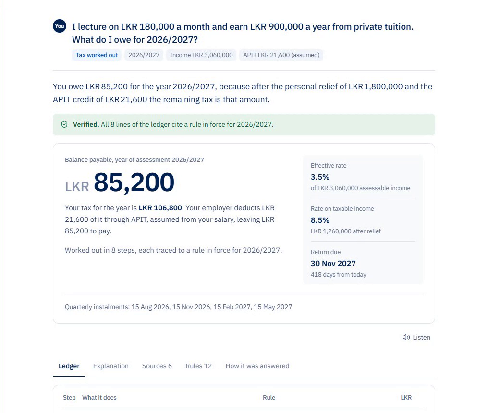</td>
<td width="50%">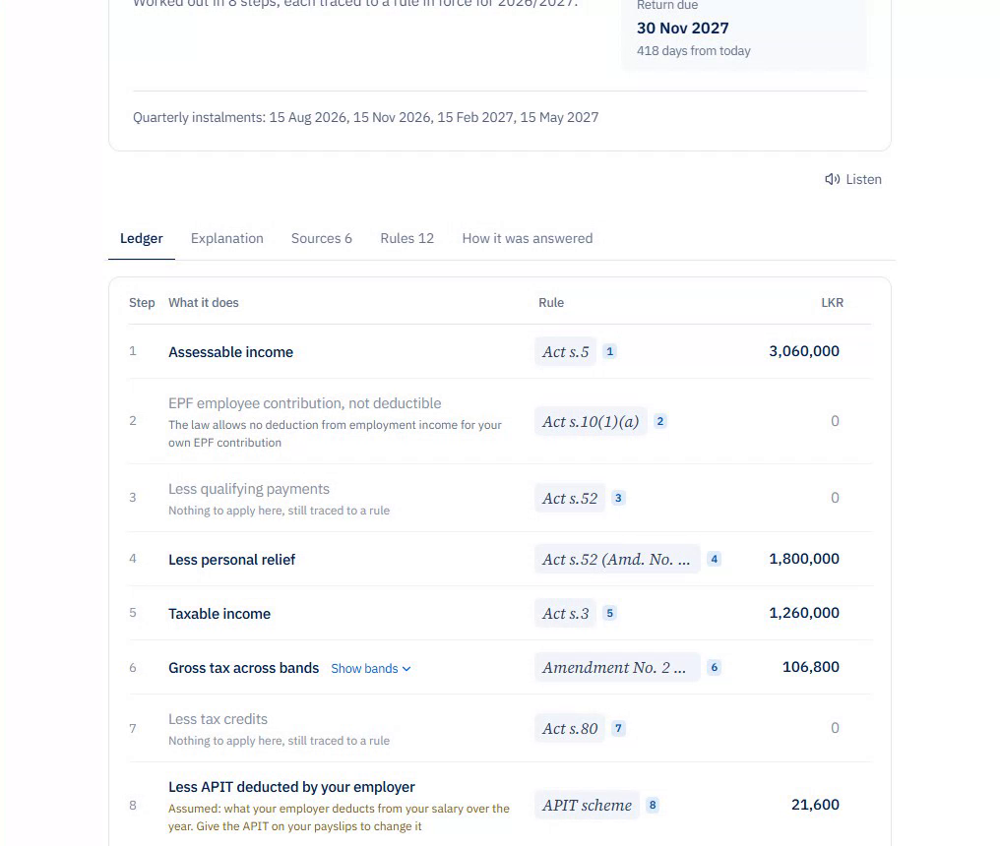</td>
</tr>
<tr>
<td>A short answer first, then the figure.</td>
<td>The ledger, every line traced to a rule in force.</td>
</tr>
</table>

---

## How an answer is made

The model reads the question and picks a plan; code does everything that produces a number.

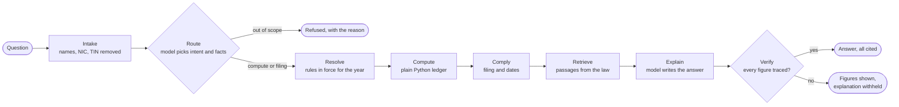

| Step | What guarantees it |
|---|---|
| **Intake** | Identifiers are removed in process, before any text reaches a model. A regex pass and spaCy NER run together. |
| **Route** | One structured model call. A regex gate checks it and its refusals always stand, so the model cannot talk its way past scope. |
| **Resolve** | Picks the rule version in force for the year and date, and refuses rather than guessing when none is. |
| **Compute** | Pure Python on `Decimal`. No model is anywhere near the arithmetic, so the same question always gives the same figures. |
| **Verify** | Every number, rate and date in the prose must match the ledger, a rule value, or a reviewed passage. One that does not match withholds the explanation. |

Each question type runs only the steps it needs:

| Question | Steps |
|---|---|
| What do I owe | Intake, Route, Resolve, Compute, Comply, Retrieve, Explain, Verify |
| Do I need to file | Intake, Route, Resolve, Compute, Comply, Explain, Verify |
| When is it due | Intake, Route, Resolve, Retrieve, Explain, Verify |
| What changed | Intake, Route, Resolve, Compare, Retrieve, Explain, Verify |
| What is the rule | Intake, Route, Resolve, Retrieve, Explain, Verify |
| Greetings and thanks | Intake, then a short reply with no figures |

---

## The law, kept current

A corpus agent watches the sources on a timer. It never decides anything: it finds changes, drafts proposals, and stops where a person has to sign.

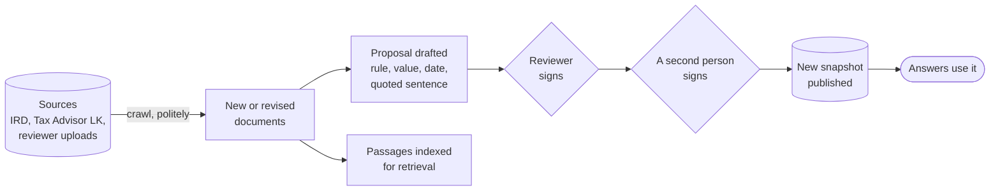

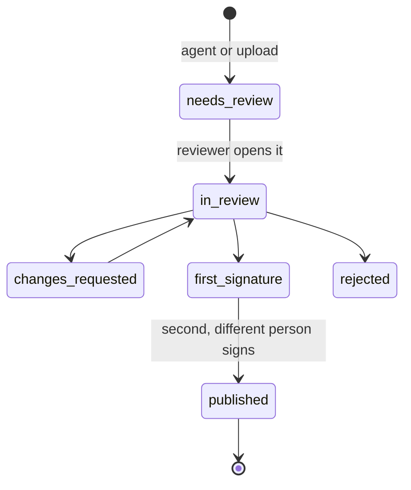

Anything that changes a computed figure needs two distinct people. Before signing, a reviewer sees an impact preview: the proposal run across a set of golden taxpayer cases, showing whose balance moves and whose filing obligation flips. Every answer records the snapshot it used, so an old answer can be checked, or asked again under today's law.

---

## Architecture

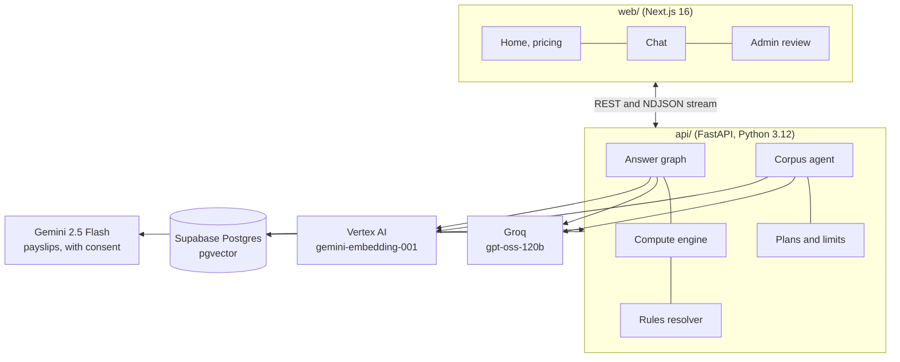

No model weights run locally. Embeddings come from Vertex AI, the language model from Groq, and payslips are read by Gemini only after the user agrees.

---

## By the numbers

Measured from the shared database and the stored runs on 8 October 2026.

| Corpus | |
|---|---|
| Source documents | 303 |
| Indexed passages | 725 |
| Published rule versions | 18, across 12 rules |
| Corpus snapshots | 6 |
| Rule proposals | 6 published, 5 open, 302 rejected |
| Agent cycles run | 43 |

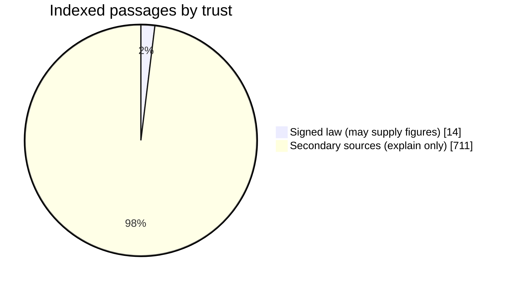

Only signed law may supply a figure to an answer. Secondary passages can explain an idea, but a number taken from one fails verification.

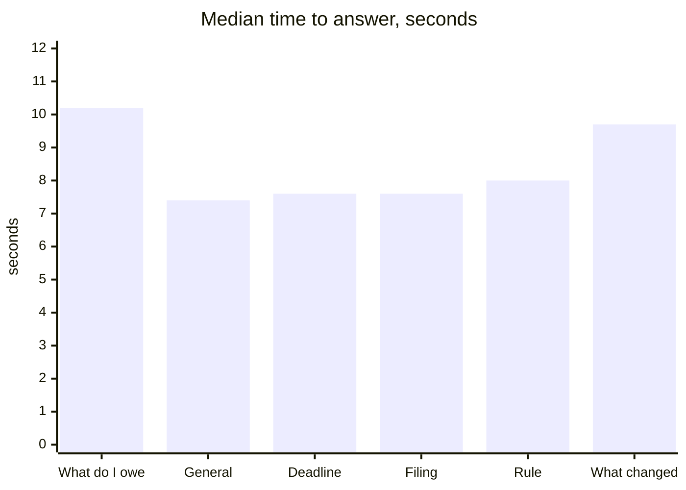

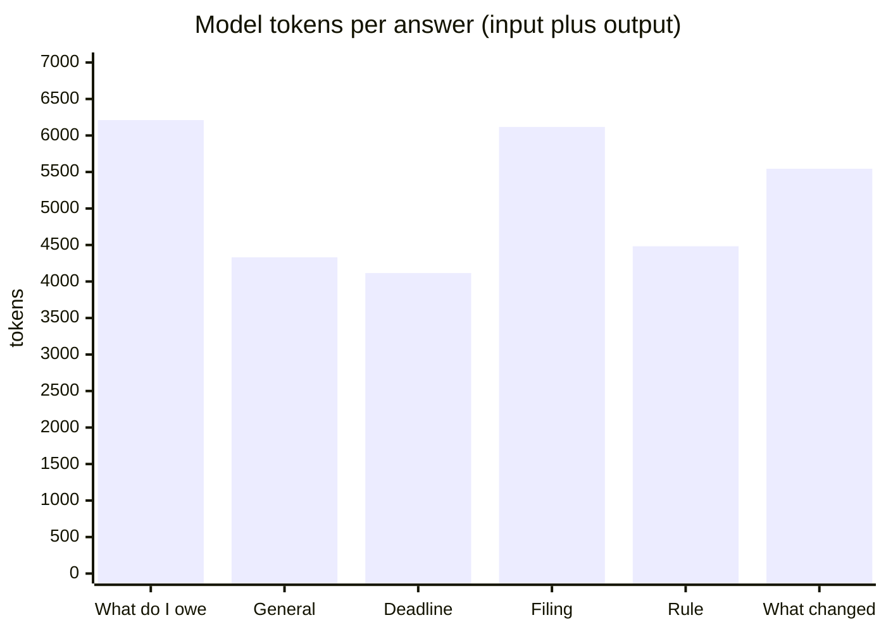

At October 2026 prices a computed answer costs about **LKR 0.65** in model time. The fixed costs (database and hosting, about LKR 20,000 a month) are what the plans pay for.

Tests: **413** (340 unit, 73 against a database). CI runs both on every pull request, the database tests on a throwaway Postgres migrated and seeded from scratch.

---

## The tax rules in use

Inland Revenue Act No. 24 of 2017, as amended by Act No. 2 of 2025 and Act No. 11 of 2026. The rules live in a versioned table; these are the values in force for 2026/2027 at the current snapshot.

| Taxable income | Rate |
|---|---|
| First 1,000,000 | 6% |
| Next 500,000 | 18% |
| Next 500,000 | 24% |
| Next 500,000 | 30% |
| Above 2,500,000 | 36% |

| Rule | Value | Source |
|---|---|---|
| Personal relief | LKR 1,800,000 | Act s.52 (Amd. No. 2 of 2025) |
| Employee EPF | Not deductible | Act s.10(1)(a) |
| Foreign-currency service income | At most 15% | First Schedule para 1(6) |
| Business expenses | Deductible, not capital items | Act s.11(1) |
| No return for APIT-only employees | Interest up to LKR 5,000 allowed | Act s.94(1)(c), (d) |
| Return due | 30 November after the year | Act s.93 |

---

## Plans

| | Free | Individual | Team |
|---|---|---|---|
| Price | LKR 0 | LKR 1,500 per year of assessment | LKR 5,000 per seat per month |
| Questions | 20 a month, or 5 a day without an account | 300 a month | 1,000 a person a month |
| Payslip reading | | ✓ | ✓ |

Every plan uses the same engine, law and checks. There is no payment gateway yet: a plan is requested in the app and granted by an admin.

<table>
<tr>
<td width="50%">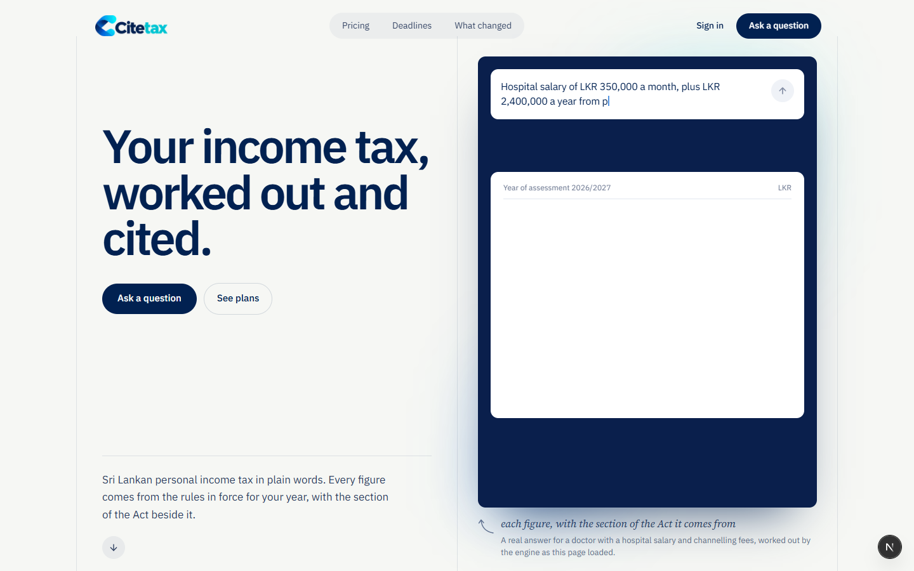</td>
<td width="50%">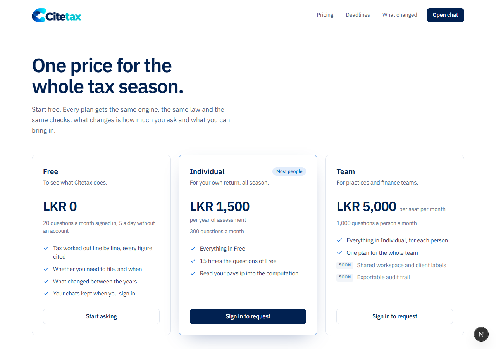</td>
</tr>
</table>

---

## Privacy

- Names, NIC and TIN numbers and employers are removed before any part of a question leaves Citetax.
- A payslip is sent to Gemini only after the user agrees on the upload screen, and the image is never stored.
- What is kept for a signed-in user is the redacted question, the figures needed to work the answer out again, and the rules it cited.

---

## Run it

Keys and first time setup are in [SETUP.md](SETUP.md).

```powershell
cd api
.venv\Scripts\python.exe preflight.py          # checks every external service
.venv\Scripts\python.exe migrate.py            # applies db/migrations
.venv\Scripts\python.exe seed\rules_seed.py    # loads the tax rules into an empty database
.venv\Scripts\python.exe -m uvicorn app.main:app --reload

cd web
npm run dev
```

| Where | What |
|---|---|
| http://localhost:3000 | Home page |
| http://localhost:3000/chat | Ask a question |
| http://localhost:3000/pricing | Plans |
| http://localhost:3000/admin | Review queue, needs the reviewer role |
| http://127.0.0.1:8000/docs | API reference |

```powershell
cd api
.venv\Scripts\python.exe -m pytest -m "not db"   # unit tests, no keys or database needed
```

### Layout

```
api/     FastAPI: answer graph, compute engine, rules resolver, privacy,
         retrieval, corpus agent, plans, admin API
web/     Next.js: home page, chat, pricing, admin panel
db/      SQL migrations, applied in order by api/migrate.py
docs/    Images used in this README
UI/      The design export the interface was built from
```

---

## Known limits

- **Residents only.** Every answer assumes a Sri Lankan tax resident.
- **Not yet modelled:** rent relief, terminal benefits and final withholding tax.
- **Scanned PDFs yield no text.** Documents are read from their text layer; OCR would be a separate service.
- **Retrieval ranking is fusion,** full text and vector results combined, not a cross encoder reranker.
- **The guest allowance is kept in memory,** per API instance.
- **The progress trace in the chat does not tick through the steps** while an answer streams (#116).

Not tax advice. Citetax states what the law provides and what the computation shows.
